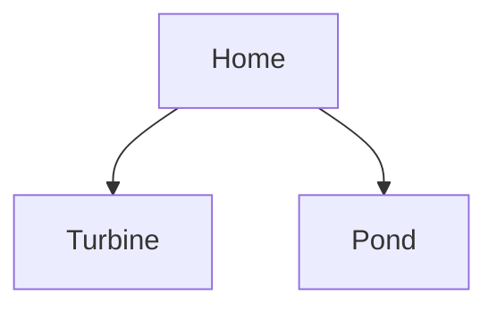

# Overview
here is my little project:
through this project I am trying to remotely control the opening of a valve for a hydroelectric turbine and to be able to measure the level of a water reserve

# Master
# Turbine
# Etang

## VL53L1X
Fil | Fct | broche
---|----|----
brun|GND|
bleu|5V|
orange|SCL|
voilet|SDA|